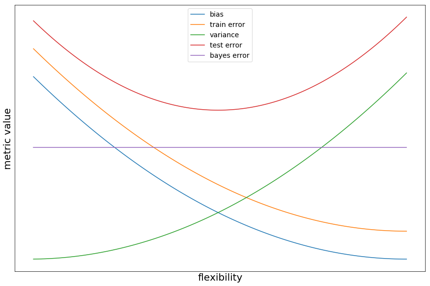

# exercise 1

For each of parts (a) through (d), indicate whether we would generally expect the performance of a flexible statistical learning method to be better or worse than an inflexible method. Justify your answer.

---
# exercise 1

*(a) The sample size n is extremely large, and the number of predictors p is small.*

---
# exercise 1

*(a) The sample size n is extremely large, and the number of predictors p is small.*

_**better:** because a large dataset will reduce the variance of the model, making it easier for a more flexible model to approximate the true function._

---

# exercise 1

_(b) The number of predictors p is extremely large, and the number of observations n is small._

---
# exercise 1

_(b) The number of predictors p is extremely large, and the number of observations n is small._

_**worse:** the model will have high variance, and since it has a high number of predictors probably it will tend overfit all the parameters_

---

# exercise 1

_(c) The relationship between the predictors and response is highly non-linear._

---
# exercise 1

_(c) The relationship between the predictors and response is highly non-linear._

_**depends:** the inflexible method will have high bias, but if we also have few data-points the model will have very high variance and the total error might be higher than a linear model. If we have a high number of data-points, then the more flexible model should have better performance_

---
# exercise 1

_(d) The variance of the error terms, i.e. $$\sigma^2 = Var(\epsilon)$$, is extremely high._

---
# exercise 1

_(d) The variance of the error terms, i.e. $$\sigma^2 = Var(\epsilon)$$, is extremely high._

_**worse:** the inflexible method will try to fit the very variable points and find patterns that aren't present_

---

# exercise 2

Explain whether each scenario is a classification or regression problem, and indicate whether we are most interested in inference or prediction. Finally, provide n and p.

---

# exercise 2

_(a) We collect a set of data on the top 500 firms in the US. For each firm we record profit, number of employees, industry and the CEO salary. We are interested in understanding which factors affect CEO salary._

---

# exercise 2

_(a) We collect a set of data on the top 500 firms in the US. For each firm we record profit, number of employees, industry and the CEO salary. We are interested in understanding which factors affect CEO salary._

## _scenario:_ regression | _interest:_ inference| _n:_ 500 | _p:_ 3

---

# exercise 2

_(b) We are considering launching a new product and wish to know whether it will be a success or a failure. We collect data on 20 similar products that were previously launched. For each product we have recorded whether it was a success or failure, price charged for the product, marketing budget, competition price,
and ten other variables._

---

# exercise 2

_(b) We are considering launching a new product and wish to know whether it will be a success or a failure. We collect data on 20 similar products that were previously launched. For each product we have recorded whether it was a success or failure, price charged for the product, marketing budget, competition price,
and ten other variables._

## _scenario:_ classification | _interest:_ prediction| _n:_ 20 | _p:_ 13

---

# exercise 2

_(c) We are interested in predicting the % change in the USD/Euro exchange rate in relation to the weekly changes in the world stock markets. Hence we collect weekly data for all of 2012. For each week we record the % change in the USD/Euro, the % change in the US market, the % change in the British market, and the % change in the German market._

---

# exercise 2

_(c) We are interested in predicting the % change in the USD/Euro exchange rate in relation to the weekly changes in the world stock markets. Hence we collect weekly data for all of 2012. For each week we record the % change in the USD/Euro, the % change in the US market, the % change in the British market, and the % change in the German market._

## _scenario:_ regression | _interest:_ prediction| _n:_ 52 | _p:_ 3

---

# exercise 3

We now revisit the bias-variance decomposition.

_(a) Provide a sketch of typical (squared) bias, variance, training error, test error, and Bayes (or irreducible) error curves, on a single plot, as we go from less flexible statistical learning methods towards more flexible approaches. The x-axis should represent the amount of flexibility in the method, and the y-axis should represent the values for each curve. There should be five curves. Make sure to label each one._

---

# exercise 3

---

# exercise 3

_(b) Explain why each of the five curves has the shape displayed in part (a)._

---

# exercise 3

_(b) Explain why each of the five curves has the shape displayed in part (a)._

_**bayes error:** the irreducible error is constant for any model_

---

# exercise 3

_(b) Explain why each of the five curves has the shape displayed in part (a)._

_**variance:** the more flexible the model is, the more it will try to adjust to the data-set_

---

# exercise 3

_(b) Explain why each of the five curves has the shape displayed in part (a)._

_**bias:** the more flexible the model is, the more complex relationships it can capture_

---

# exercise 3

_(b) Explain why each of the five curves has the shape displayed in part (a)._

_**test error:** it starts to decrease together with the model bias, but once the variance starts to increase it increases due to overfitting_

---

# exercise 3

_(b) Explain why each of the five curves has the shape displayed in part (a)._

_**training error:** it decreases as more flexible models start to "learn" the data_

---

# exercise 4

You will now think of some real-life applications for statistical learning.

---

# exercise 4

_(a) Describe three real-life applications in which classification might be useful. Describe the response, as well as the predictors. Is the goal of each application inference or prediction? Explain your answer._

---

# exercise 4

_(a) Describe three real-life applications in which classification might be useful. Describe the response, as well as the predictors. Is the goal of each application inference or prediction? Explain your answer._

_**i:** predict whether a person will have cancer in the next 5 years given his/her age, gender and how many cigarettes smokes a day_

---

# exercise 4

_(a) Describe three real-life applications in which classification might be useful. Describe the response, as well as the predictors. Is the goal of each application inference or prediction? Explain your answer._

_**ii:** estimate how eating fruits affect the probability of getting stomach cancer_

---

# exercise 4

_(a) Describe three real-life applications in which classification might be useful. Describe the response, as well as the predictors. Is the goal of each application inference or prediction? Explain your answer._

_**iii:** detect whether a prospect client will fail or not given its wage and job title_

---

# exercise 4

_(b) Describe three real-life applications in which regression might be useful. Describe the response, as well as the predictors. Is the goal of each application inference or prediction? Explain your answer._

---

# exercise 4

_(b) Describe three real-life applications in which regression might be useful. Describe the response, as well as the predictors. Is the goal of each application inference or prediction? Explain your answer._

_**i:** estimate how the gender, years of experience and education affect the income or a person_

---

# exercise 4

_(b) Describe three real-life applications in which regression might be useful. Describe the response, as well as the predictors. Is the goal of each application inference or prediction? Explain your answer._

_**ii:** predict the price of a house given the size in sq meters, number of bedrooms, and parking slots_

---

# exercise 4

_(b) Describe three real-life applications in which regression might be useful. Describe the response, as well as the predictors. Is the goal of each application inference or prediction? Explain your answer._

_**iii:** predict what will be the order value that a user will make given the products he has seen_

---

# exercise 4

_(c) Describe three real-life applications in which cluster analysis might be useful._

---

# exercise 4

_(c) Describe three real-life applications in which cluster analysis might be useful._

_**i:** group different groups of clients but the kind of products they buy_

---

# exercise 4

_(c) Describe three real-life applications in which cluster analysis might be useful._

_**ii:** decide where to open comic stores in a city given the lat and lon of schools_

---

# exercise 4

_(c) Describe three real-life applications in which cluster analysis might be useful._

_**iii:** group the location of stores in clusters to pre-process data to use it as input in a model_

---

# exercise 5

_What are the advantages and disadvantages of a very flexible (versus a less flexible) approach for regression or classification? Under what circumstances might a more flexible approach be preferred to a less flexible approach? When might a less flexible approach be preferred?_

_**advantages:** capture more complex relationships yielding a lower bias_

_**disadvantages:** needs more data to yield a good model; are harder to interpret, making them worse suited for inference; more computation required to fit them; prone to overfit_

---

# exercise 5

_What are the advantages and disadvantages of a very flexible (versus a less flexible) approach for regression or classification? Under what circumstances might a more flexible approach be preferred to a less flexible approach? When might a less flexible approach be preferred?_

_**a less flexible approach is preferred:** when we want to make inference, when we have a small data-sample, and the model is linear_

_**a more flexible approach is preferred:** when we want to make predictions, we have a huge data-sample, and the model is not linear_

---

# exercise 6

Describe the differences between a parametric and a non-parametric statistical learning approach. What are the advantages of a parametric approach to regression or classification (as opposed to a non-parametric approach)? What are its disadvantages?

_**parametric:** assumes a functional form of $$f$$ defined by a set of parameters, so reduces the problem from estimating $$f$$ to estimate a set of parameters that define $$f$$_

---

# exercise 6

Describe the differences between a parametric and a non-parametric statistical learning approach. What are the advantages of a parametric approach to regression or classification (as opposed to a non-parametric approach)? What are its disadvantages?

_**non-parametric:** a non-parametric approach makes no assumptions about the functional form of $$f$$, but it finds it through grouping similar observations from the data-sample_

---

# exercise 6

Describe the differences between a parametric and a non-parametric statistical learning approach. What are the advantages of a parametric approach to regression or classification (as opposed to a non-parametric approach)? What are its disadvantages?

_**advantages:** a parametric approach converges much more quickly to a set of parameters, thus requires a smaller data-set for training_

_**disadvantages:** since it makes assumptions about the form of $$f$$ , these assumptions might be wrong which leads to inaccurate estimations of $$f$$_

---
# exercise 7

The table below provides a training data set containing six observations, three predictors, and one qualitative response variable.

| obs | _X1_ | _X2_ | _X3_ | _Y_ |
|:---:| :-----: | :-----: | :-----: | :---: |
| 1   |       0 |    3    |    0.   |  Red  |
| 2 | 2 | 0 | 0 | Red |
| 3 | 0 | 1 | 3 | Red |
| 4 | 0 | 1 | 2 | Green |
| 5 | -1 | 0 | 1 | Green |
| 6 | 1 | 1 | 1 | Red |

---

# exercise 7

Suppose we wish to use this data set to make a prediction for Y when $$X1 = X2 = X3 = 0$$ using K-nearest neighbors.

---

# exercise 7

_(a) Compute the Euclidean distance between each observation and the test point, X1 = X2 = X3 = 0._

---

# exercise 7

_(a) Compute the Euclidean distance between each observation and the test point, X1 = X2 = X3 = 0._

| obs | 1 | 2 | 3 | 4 | 5 | 6 |
|:---:|:---:|:---:|:---:|:---:|:---:|:---:|
|dist| 3 | 2 | 3.16 | 2.23 | 1.41 | 1.73 |

---

# exercise 7

_(b) What is our prediction with K = 1? Why?_

---

# exercise 7

_(b) What is our prediction with K = 1? Why?_

_**Green:** because the 5th point is the closest one_

---

# exercise 7

_(c) What is our prediction with K = 3? Why?_

---

# exercise 7

_(c) What is our prediction with K = 3? Why?_

_**Red:** because the three closest points have [Red, Green, Red] as labels, since Red is the most common, thats the prediction_

---

# exercise 7

_(d) If the Bayes decision boundary in this problem is highly nonlinear, then would we expect the best value for K to be large or small? Why?_

---

# exercise 7

_(d) If the Bayes decision boundary in this problem is highly nonlinear, then would we expect the best value for K to be large or small? Why?_

_**small:** because the decision boundary with a small value of K would be more flexible_

---

# that's it