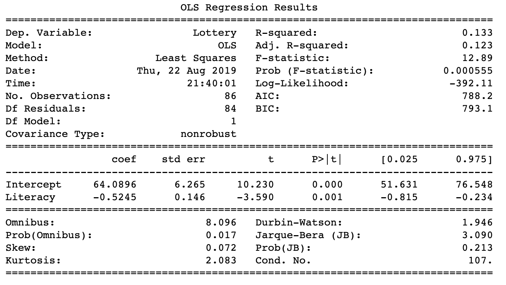
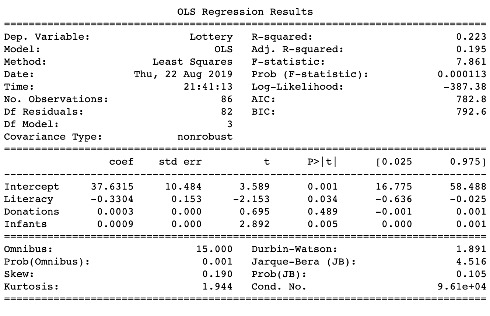
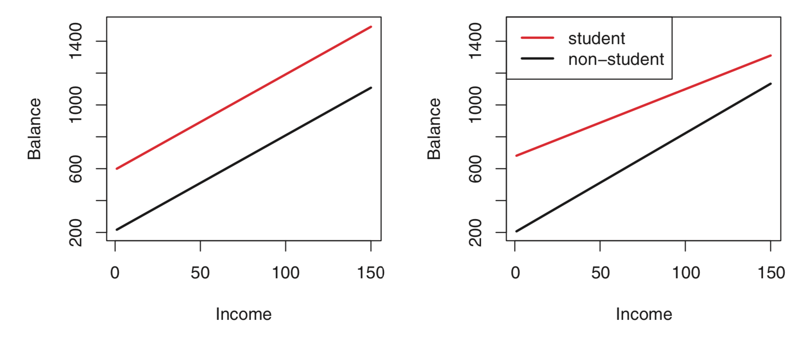
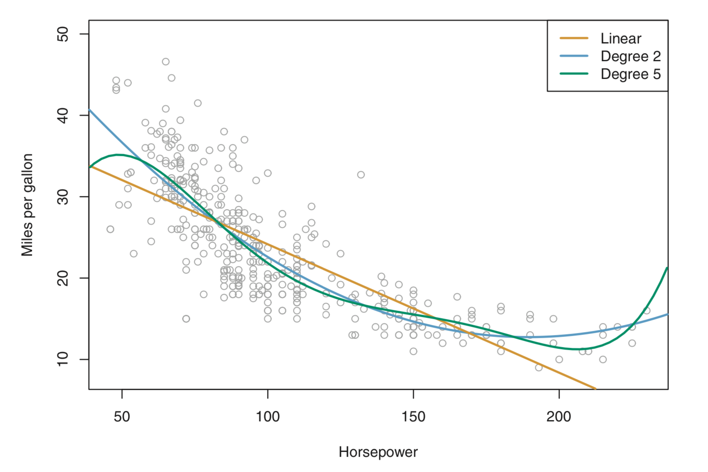
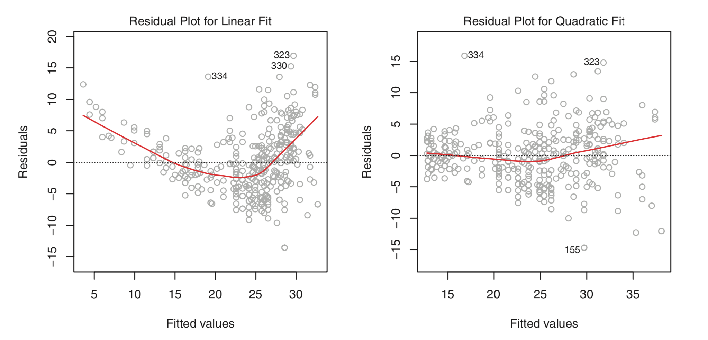
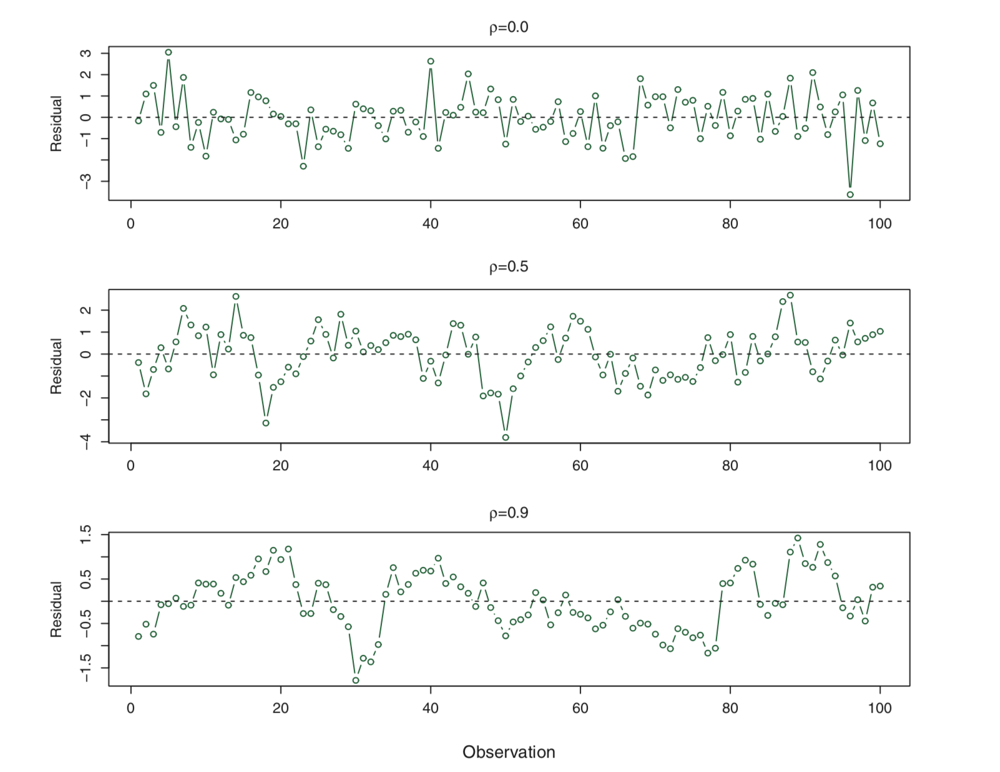
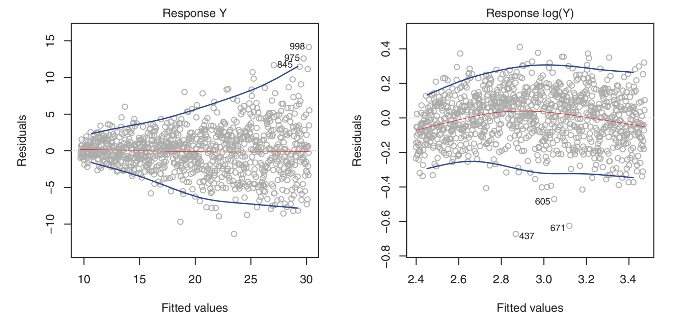
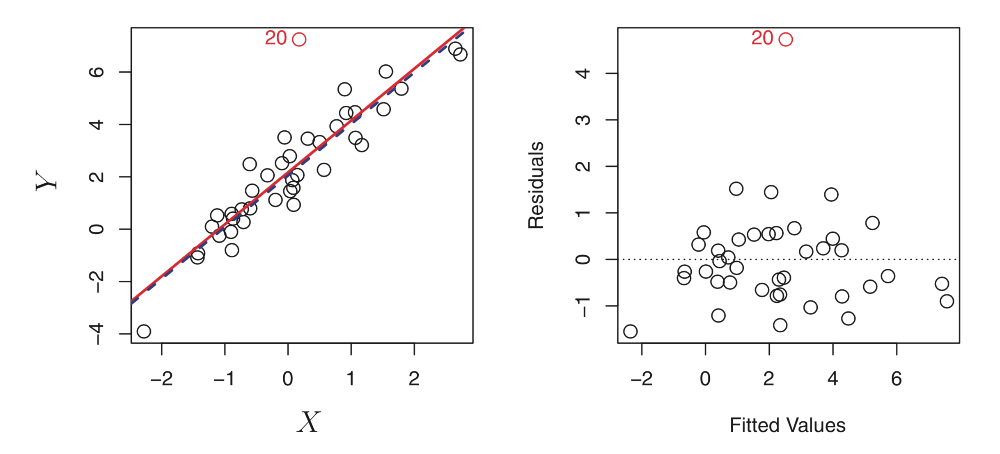
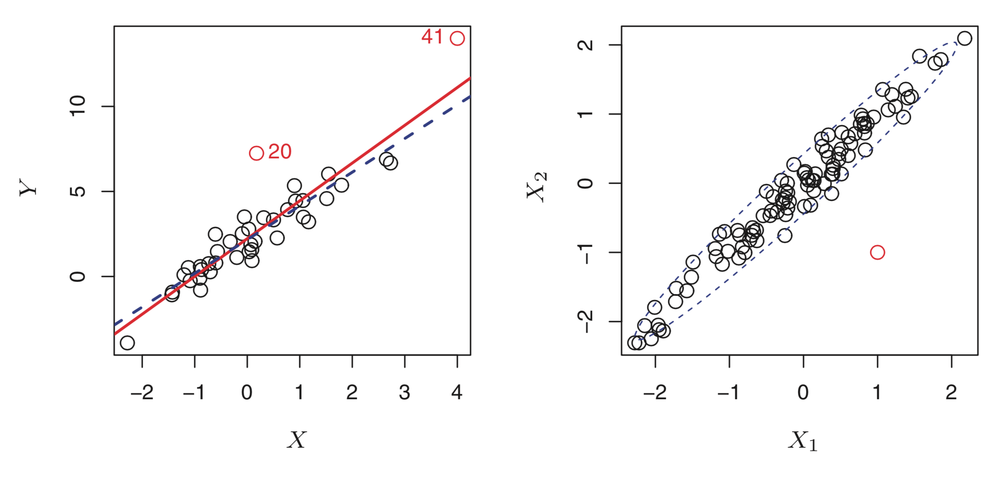
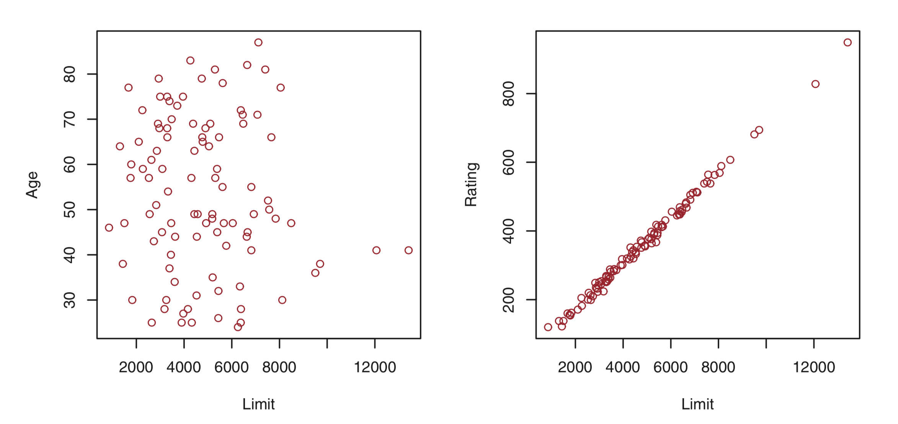

# introduction to statistical learning

## chapter iii summary - linear regression

---

# simple linear regression

$$Y \approx \beta_0 + \beta_1 X$$

---

## estimating coefficients

$$
\begin{eqnarray*}
\hat{y}_i &=& \hat{\beta}_0 + \hat{\beta}_1 x_i\\
& & \\
& & \hspace{18cm}\\
\end{eqnarray*}
$$

---

## estimating coefficients

$$
\begin{eqnarray*}
\hat{y}_i &=& \hat{\beta}_0 + \hat{\beta}_1 x_i\\
e_i &=& y_i - \hat{y}_i \\
& & \hspace{18cm}\\
\end{eqnarray*}
$$

---

## estimating coefficients

$$
\begin{eqnarray*}
\hat{y}_i &=& \hat{\beta}_0 + \hat{\beta}_1 x_i\\
e_i &=& y_i - \hat{y}_i \\
RSS &=& e_1^2 + e_2^2 + \dots + e_n^2\\
& & \hspace{18cm}\\
\end{eqnarray*}
$$

^ RSS Residual Sum of Squares

---
## estimating coefficients

### coefficients value

$$
\begin{eqnarray*}
\hat{\beta}_1 &=& {{\sum_{i=1}^n{(x_i - \bar{x})(y_i - \bar{y})}}\over{\sum_{i=1}^n{(x_i - \bar{x})^2}}}\\
\\
\hat{\beta}_0 &=& \bar{y} - \hat{\beta}_1 \bar{x}\\
\end{eqnarray*}
$$

---

## estimating coefficients
### coefficients error

$$ SE(\hat{\beta}_0)^2 = \sigma^2 \bigg[ {{1}\over{n}} + {{\bar{x}^2}\over{\sum_{i=1}^{n}{(x_i - \bar{x})^2}}} \bigg] $$

$$ SE(\hat{\beta}_1)^2 = {{\sigma^2}\over{\sum_{i=1}^{n}{(x_i - \bar{x})^2}}} $$

$$ \hat{\sigma} = \sqrt{RSS / n-2} $$

---

## assessing the coefficients
### confidence interval beta

$$ \hat{\beta}_0 \pm 2 \cdot SE(\hat{\beta}_0) $$

$$ \hat{\beta}_1 \pm 2 \cdot SE(\hat{\beta}_1) $$

---
## assessing the coefficients
### hypothesis testing

$$ H_0: \hat{\beta}_1 = 0 $$
$$ H_1: \hat{\beta}_1 \neq 0 $$

$$ t = {{\hat{\beta}_1 - 0}\over{SE(\hat{\beta}_1)}} $$

---

## assessing the coefficients
### statsmodel

---

## assessing the model
### residual standard error

$$ RSE = \sqrt{{{1}\over{n - p - 1}} RSS} $$

^ RSS Residual Sum of Squares

---

## assessing the model
### $$R^2$$

$$ R^2 = {{TSS - RSS}\over{TSS}} = 1- {{RSS}\over{TSS}} $$

$$ RSS = \sum_{i=1}^{n}{(y_i - \hat{y}_i)^2} $$

$$ TSS = \sum_{i=1}^{n}{(y_i - \bar{y})^2} $$

^ comparing the model to a simple prediction (average)

---

# multiple linear regression

$$ Y = \beta_0 + \beta_1 X_1 + \beta_2 X_2 + \dots + \beta_p X_p + \epsilon $$

---

## estimating the coefficients

### coefficients value

$$ Y = \begin{bmatrix}
   y_1 \\
   y_2 \\
    \vdots \\
    y_n
\end{bmatrix}
X = \begin{bmatrix}
1 & x_{11} & x_{12} & \cdots & x_{1p} \\
1 & x_{21} & x_{22} & \cdots & x_{2p} \\
1 & x_{i1} & x_{i2} & \cdots & x_{ip} \\
\vdots & \vdots & \vdots & \ddots & \vdots \\
1 & x_{n1} & x_{n2} & \cdots & x_{np} \\
\end{bmatrix}
$$

$$ 
\begin{align}
\hat{\beta} &= \begin{bmatrix}
       \hat{\beta}_0 \\
       \hat{\beta}_1 \\
       \vdots \\
       \hat{\beta}_p
\end{bmatrix}
\end{align} =
 (X'X)^{-1}X'Y $$

---

## estimating the coefficients

### coefficients error

$$SE(\hat{\beta})^2 = \sigma^2 (X' X)^ {-1}$$

$$\hat{\sigma}^2 = \frac{e'e}{n-p} $$

---
## assessing the coefficients and model
### statsmodel

---

## questions

### F-Test

$$ F = {{(TSS - RSS) / p}\over{RSS / (n - p - 1)}} $$

---

## questions
### Model selection
#### forward selection
#### backward selection
#### mixed selection

---

## questions
### model fit

$$R^2$$

$$RSE$$

---
## questions
### predictions

$$ SE(\hat{y}_0) =  \sqrt{\sigma^2 \bigg[ 1 + \frac{1}{n} + {{(x_0 - \bar{x})^2}\over{\sum_{i=1}^{n}{(x_i - \bar{x})^2}}} \bigg]} $$

$$ \hat{y}_0 \pm t_{0.975,n-2} \cdot SE(\hat{y}_0) $$

---

# other considerations

---

## qualitative predictors
### binary

$$
x_{i2}=\begin{cases}
1 \text{ has some characteristic}\\
0 \text{ doesn't have that characteristic}
\end{cases}
$$

$$ y_i = \beta_0 + \beta_1 x_{i1} + \beta_2 x_{i2} + \epsilon_i $$

$$
y_i=\begin{cases}
\beta_0 + \beta_1 x_{i1} + \beta_2 + \epsilon & \text{if the ith sample is positive}\\
\beta_0 + \beta_1 x_{i1} + \epsilon_i  & \text{if the ith sample is not positive}
\end{cases}
$$

---

## qualitative predictors
### multiple

$$
x_{i2}=\begin{cases}
1 \text{ if A}\\
0 \text{ if not A}
\end{cases}
$$

$$
x_{i3}=\begin{cases}
1 \text{ if B}\\
0 \text{ if not B}
\end{cases}
$$

$$y_i = \beta_0 + \beta_1 x_{i1} + \beta_2 x_{i2} + \beta_3 x_{i3} + \epsilon_i$$

$$
y_i= \begin{cases}
\beta_0 + \beta_1 x_{i1} + \beta_2 + \epsilon & \text{if A}\\
\beta_0 + \beta_1 x_{i1} + \beta_3 + \epsilon_i  & \text{if B}\\
\beta_0 + \beta_1 x_{i1} + \epsilon_i  & \text{if C}
\end{cases}
$$

---

## extensions
### removing additive assumption

$$ Y = \beta_0 + \beta_1 X_1 + \beta_2 X_2 + \beta_3 X_1 X_2 + \epsilon$$

$$ Y = \beta_0 + (\beta_1 + \beta_3 X_2) X_1 + \beta_2 X_2  + \epsilon $$

$$ Y = \beta_0 + \beta_1 X_1 + (\beta_2  + \beta_3 X_1)X_2  + \epsilon $$

---

## extensions
### removing additive assumption

---

## extensions
### non-linear relationships

---

## potential problems
### non-linearity of the response-predictor relationships

---

## potential problems
### correlation of the error terms

---

## potential problems
### non-constant variance of error terms

---

## potential problems
### outliers

---

## potential problems
### high-leverage points

---

## potential problems
### collinearity

---

# that's it
